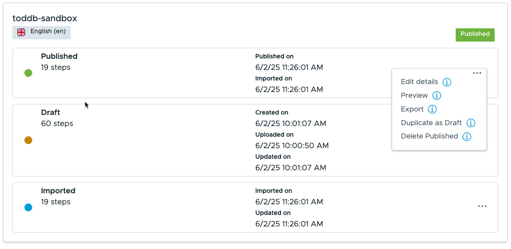

Export VLP Manual to ZIP

shorthen the zip file to make it easier
Unzip the folder
Move the folder to where you  run the convert to docx

run ./start.convert.sh

answer with name of folder to find the unziped manual

Find new word docx file call convert_xml_to_docx.py

